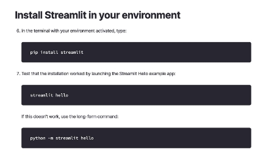

Generating PDFs for Question Papers and MCQs

Introduction

For teachers, educational hubs, and exam preparation platforms, creating high-quality question papers and Multiple-Choice Question (MCQ) assessments is crucial yet time-consuming. Fortunately, several tools and techniques can streamline this process, allowing educators to focus on content creation rather than tedious formatting. This article explores how to effectively generate PDFs for question papers and MCQs, catering to various needs, from classroom tests to large-scale mock exams like the JEE.

Overview

This Streamlit application allows users to upload a PDF file and ask questions about its contents using Google’s Gemini AI.

Why Digital Question Paper Generation Matters

Benefits of Digital Question Paper Creation

- Consistency: Ensure uniform formatting and quality
- Randomization: Create multiple unique test versions
- Efficiency: Save time in exam preparation
- Accessibility: Easy to distribute and store digitally
- Customization: Quickly customize your question paper as per your format.

Features

1. PDF file upload
1. Text extraction from PDF
1. AI-powered question answering with Gemini
1. User-friendly interface

Prerequisites

1. Python 3.8+
1. pip (Python package manager)
1. Google Cloud Account and Credits
1. Google Gemini API Key
1. Google AI Studio
1. Streamlit

High-Level architecture:

Step-by-step Instructions

- Create a Google Cloud account and activate your credits.

- Install Python and ensure it’s added to your PATH.
- Install Streamlit for the front end.

- Install all pip (required package)
- Integrate Gemini

- Tune prompt with Google AI Studio

Installation and Running

To set up and run the application:

1. Install dependencies: 

pi p  i nst al l  - r  r equi r ement s. t xt

pi p  i nst al l  pyPDF2

pi p  i nst al l  st r eaml i t  pdf pl umber  googl e- gener at i veai

2. Run the app: 

st r eaml i t  r un  mcq. py

Setting Up Gemini

1. Access the Gemini Platform: Log in to your Google Cloud Console and enable Gemini APIs in your project.
2. Install Required SDKs: Install the necessary Google Cloud libraries using  pi p  i nst al l  googl e- cl oud . These libraries allow seamless interaction with Gemini APIs.
2. Authenticate: Download your Google Cloud credentials and authenticate your project using

Tune Model for Prompts:

To fine-tune the model, I utilized Google AI Studio to extract question papers from PDF documents. Subsequently, I employed Gen AI Prompts to further refine the model’s capabilities.

Navigating Dashboard to New Tuned Model

![ref1]

Following the selection of the tune model, a structured prompt was crafted to facilitate user-like ![ref1]queries during the fine-tuning process.

Leveraging provided input prompts, the model was fine-tuned and trained to generate the

desired output.

Some samples of tune input.

Code Sample:

1. Import all dependencies

   i mpor t  s t r eaml i t  as  s t 

   i mpor t  PyPDF2  

   i mpor t  googl e. gener at i veai  as  genai i mpor t  os

2. Configure the Gemini API with the API key from the environment variable.

def  conf i gur e\_gemi ni \_api ( ) :

`     `"""

`     `Conf i gur e  t he  Gemi ni  API  wi t h  t he  API  key  f r

`     `Ret ur ns :

`         `bool :  Tr ue  i f  API  i s  s ucces s f ul l y  conf i g      """

`     `t r y:

- Tr y  t o  get  API  key  f r om  envi r onment  va api \_key  =  os . get env( ' GOOGLE\_API \_KEY' )
- I f  not  i n  envi r onment ,  t r y  St r eaml i t  s

`         `i f  not  api \_key:

`             `api \_key  =  ( ' GOOGLE\_API \_KEY' )

`         `i f  not  api \_key:

`             `s t . er r or ( "Googl e  API  Key  not  f ound.              r et ur n  Fal s e

- Conf i gur e  t he  Gemi ni  API

`         `genai . conf i gur e( api \_key=api \_key)

`         `r et ur n  Tr ue

`     `except  Except i on  as  e:

`         `s t . er r or ( f "Er r or  conf i gur i ng  Gemi ni  API :          r et ur n  Fal s e

Extract text from the uploaded PDF file.

def  ext r act \_t ext \_f r om\_pdf ( upl oaded\_f i l e) :

`     `"""

`     `Ext r act  t ext  f r om  an  upl oaded  PDF  f i l e.

`     `Ar gs :

`         `upl oaded\_f i l e  ( Upl oadedFi l e) :  The  upl oad

`     `Ret ur ns :

`         `s t r :  Ext r act ed  t ext  f r om  t he  PDF

`     `"""

`     `t r y:

- Read  t he  PDF  f i l e

`         `pdf \_r eader  =  PyPDF2. Pdf Reader ( upl oaded\_f

- Ext r act  t ext  f r om  al l  pages

`         `t ext  =  ""

`         `f or  page  i n  pdf \_r eader . pages :

`             `t ext  +=  page. ext r act \_t ext ( )  +  "\ n"

`         `r et ur n  t ext

`     `except  Except i on  as  e:

`         `s t . er r or ( f "Er r or  ext r act i ng  t ext  f r om  PD          r et ur n  ""

Generate a response with the help of Google Gemini AI

def  gener at e\_r es pons e\_wi t h\_gemi ni ( t ext ,  pr ompt ) :      """

`     `Gener at e  a  r es pons e  us i ng  Googl e' s  Gemi ni  mo

`     `Ar gs :

`         `t ext  ( s t r ) :  Text  ext r act ed  f r om  t he  PDF          pr ompt  ( s t r ) :  Us er ' s  quer y  pr ompt

`     `Ret ur ns :

`         `s t r :  Gener at ed  r es pons e  f r om  Gemi ni

`     `"""

`     `t r y:

- Choos e  a  Gemi ni  model

`         `model  =  genai . Gener at i veModel ( ' gemi ni - pr

- Cons t r uct  t he  f ul l  pr ompt  wi t h  cont ext f ul l \_pr ompt  =  f """

  Cont ext  f r om  PDF:

  {t ext [ : 10000] }   #  Li mi t  cont ext  t o  f i r s t

  Us er  Quer y:  {pr ompt }

  Pl eas e  pr ovi de  a  det ai l ed  and  accur at e  r

  """

- Gener at e  r es pons e

r es pons e  =  model . gener at e\_cont ent ( f ul l \_p

`         `r et ur n  r es pons e. t ext

`     `except  Except i on  as  e:

`         `s t . er r or ( f "Er r or  gener at i ng  r es pons e  wi t          r et ur n  "Coul d  not  gener at e  a  r es pons e.  P

Output / Demo:

[PDF2MCQ.mov](https://medium.com/r/?url=https%3A%2F%2Fdrive.google.com%2Ffile%2Fd%2F1foSg16ZqFMaMAP2qND_fFvfOhf5z1OL4%2Fview%3Fusp%3Dsharing)

[Edit description drive.google.com](https://medium.com/r/?url=https%3A%2F%2Fdrive.google.com%2Ffile%2Fd%2F1foSg16ZqFMaMAP2qND_fFvfOhf5z1OL4%2Fview%3Fusp%3Dsharing)

At the end of this project, the user can

1. The user can upload a pdf and extract text from a pdf.
1. Can generate a subjective question paper and MCQ for assessments.
1. Question Paper patterns can be like JEE exams and Mock Tests.

What’s next?

The app can be expanded to include:

1. Generate a new question paper based on the previous year's exam.
1. Can generate exam papers according to specific patterns.
1. Generate an answer key according to the paper.

Resources:

- [Streamlit documentation](https://medium.com/r/?url=https%3A%2F%2Fdocs.streamlit.io%2Fget-started%2Finstallation%2Fcommand-line)
- [GitHub Repository](https://medium.com/r/?url=https%3A%2F%2Fgithub.com%2Fdevish2%2FPDF2MCQ)

Call to action

To learn more about Google Cloud services and to create an impact for the work you do, get around to these steps right away:

- Register for [Code Vipassana sessions](https://medium.com/r/?url=https%3A%2F%2Frsvp.withgoogle.com%2Fevents%2Fcv)
- Join the meetup group [Datapreneur Social](https://medium.com/r/?url=https%3A%2F%2Fwww.meetup.com%2Fdatapreneur-social%2F)
- Sign up to become a [Google Cloud Innovator](https://medium.com/r/?url=https%3A%2F%2Fcloud.google.com%2Finnovators%3Futm_source%3Dcloud_sfdc%26utm_medium%3Demail%26utm_campaign%3DFY23-1H-vipassana-innovators%26utm_content%3Djoininnovators%26utm_term%3D-)

[ref1]: Aspose.Words.38df70a7-5738-416c-8084-d21f37ab81b5.010.jpeg
